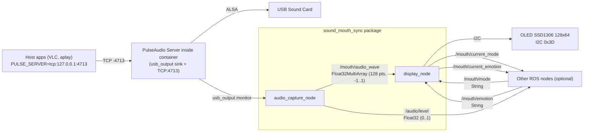
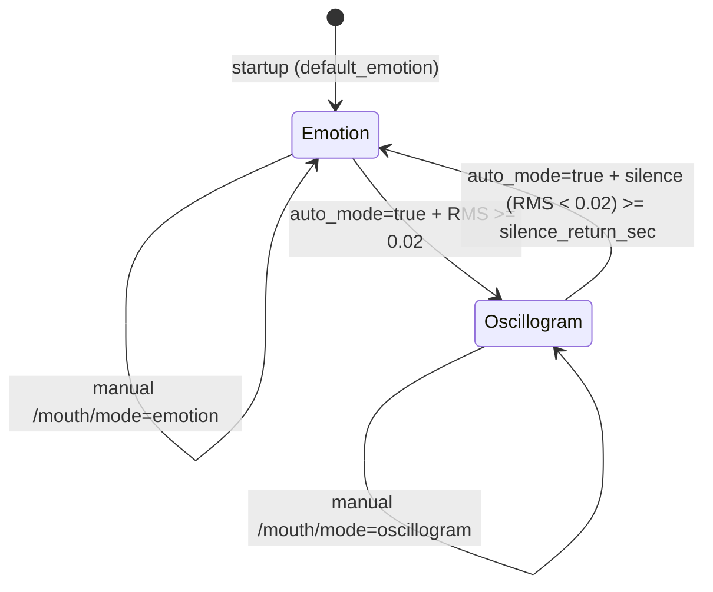

# sound_mouth_sync

ROS-пакет для управления OLED-дисплеем SSD1306 128x64 (I2C 0x3D) на голове робота Ainex (область рта). Два режима работы:

1. **emotion** — статичное выражение рта (happy, sad, neutral, ...) или пользовательские PNG-изображения
2. **oscillogram** — визуализация звука в реальном времени (осциллограмма всех звуков, воспроизводимых системой)

## Схема работы (как “ходит” сигнал)

Дисплей управляется двумя ROS-нодаc: `audio_capture_node` (захват и преобразование звука в осциллограмму) и `display_node` (отрисовка эмоций или волны на OLED).



### Режимы отображения на OLED

`display_node` может работать в двух режимах:

1) `emotion` — рисует выбранную эмоцию (например `happy`/`sad`)  
2) `oscillogram` — рисует осциллограмму по данным `/mouth/audio_wave`

Автопереключение задаётся параметром `auto_mode`:



Подробная архитектура (с более полными диаграммами): [doc/ARCHITECTURE.md](doc/ARCHITECTURE.md)

## Быстрый старт

```bash
# Запуск обеих нод
roslaunch sound_mouth_sync sound_mouth_sync.launch

# С нестандартной эмоцией при старте
roslaunch sound_mouth_sync sound_mouth_sync.launch default_emotion:=happy

# Отключить авто-переключение на осциллограмму
roslaunch sound_mouth_sync sound_mouth_sync.launch auto_mode:=false
```

## Пошаговая инструкция для новичка

Ниже — “минимальный путь”, чтобы убедиться, что OLED реагирует на ваши команды и на звук.

### 1) Подготовка (разово)
1. Включите I2C на Raspberry Pi (чтобы OLED SSD1306 по адресу `0x3D` мог работать).
2. Убедитесь, что USB-звуковая карта определяется: выполните `aplay -l` (должна быть запись про USB Audio Device).
3. Установите зависимости (Python + системные пакеты). Подробно: раздел `## Зависимости` ниже.

### 2) Поднимите ROS и запустите пакет
1. В терминале ROS подгрузите окружение (пример для Noetic):
   ```bash
   source /opt/ros/noetic/setup.bash
   source ~/ros_ws/devel/setup.bash
   ```
2. Запустите пакет:
   ```bash
   roslaunch sound_mouth_sync sound_mouth_sync.launch
   ```
3. Проверьте, что ноды стартовали:
   ```bash
   rosnode list | grep mouth_
   ```

### 3) Проверьте топики (что ноды “видят”)
1. Посмотрите, что появились основные топики:
   ```bash
   rostopic list | grep -E "^/mouth/|^/audio/level$"
   ```
2. Посмотрите уровень громкости (должен меняться при воспроизведении звука):
   ```bash
   rostopic echo /audio/level
   ```

### 4) Добейтесь осциллограммы по звуку
Осциллограмма появляется, когда звук проходит через PulseAudio, который поднимает `audio_capture_node` внутри контейнера.

Вариант A (звук внутри контейнера, рекомендуется)
```bash
paplay /path/to/sound.wav
```

Вариант B (звук на хосте Raspberry Pi: VLC/aplay)
1. Настройте маршрутизацию звука на PulseAudio контейнера:
   ```bash
   source $(rospack find sound_mouth_sync)/scripts/setup_host_audio.sh --check
   ```
2. Сделайте тест-проигрывание:
   ```bash
   paplay /usr/share/sounds/alsa/Front_Left.wav
   ```

### 5) Управляйте эмоциями вручную
1. Переключить режим (вручную):
   ```bash
   rostopic pub -1 /mouth/mode std_msgs/String "data: 'emotion'"
   rostopic pub -1 /mouth/mode std_msgs/String "data: 'oscillogram'"
   ```
2. Поставить эмоцию (пример):
   ```bash
   rostopic pub -1 /mouth/emotion std_msgs/String "data: 'happy'"
   ```

Полный список тем для `/mouth/emotion` и примеры со “случайной” осциллограммой — в разделе `## Топики` ниже.

### 6) Сами добавьте эмоцию (PNG)
1. Положите изображение в `resources/emotions/` и назовите файл именем эмоции, например `wink.png`.
2. Требования: 128x64, 1-bit черно-белое.
3. После добавления — перезапустите ноду.

## Топики

### Входные (подписка)

| Топик | Тип | Описание |
|-------|-----|----------|
| `/mouth/mode` | `std_msgs/String` | Режим: `"emotion"` или `"oscillogram"` |
| `/mouth/emotion` | `std_msgs/String` | Эмоция: `neutral`, `happy`, `sad`, `angry`, `surprised`, `excited`, `sleepy`, `love`, `confused`, `scared`, `bored`, `calm`, `disgusted`, `tired` |
| `/mouth/audio_wave` | `std_msgs/Float32MultiArray` | 128 значений от -1.0 до 1.0 для осциллограммы |

### Выходные (публикация)

| Топик | Тип | Описание |
|-------|-----|----------|
| `/mouth/current_mode` | `std_msgs/String` (latch) | Текущий режим дисплея |
| `/mouth/current_emotion` | `std_msgs/String` (latch) | Текущая эмоция |
| `/audio/level` | `std_msgs/Float32` | RMS-уровень звука 0..1 (совместимость) |

## Примеры rostopic pub для отладки

### Переключение режима

```bash
# Режим эмоций
rostopic pub -1 /mouth/mode std_msgs/String "data: 'emotion'"

# Режим осциллограммы
rostopic pub -1 /mouth/mode std_msgs/String "data: 'oscillogram'"
```

### Установка эмоции

```bash
# Улыбка
rostopic pub -1 /mouth/emotion std_msgs/String "data: 'happy'"

# Грусть
rostopic pub -1 /mouth/emotion std_msgs/String "data: 'sad'"

# Удивление
rostopic pub -1 /mouth/emotion std_msgs/String "data: 'surprised'"

# Нейтральное выражение
rostopic pub -1 /mouth/emotion std_msgs/String "data: 'neutral'"
```

### Публикация тестовой осциллограммы

```bash
# Синусоида (2 периода по 128 точкам)
rostopic pub -1 /mouth/audio_wave std_msgs/Float32MultiArray \
  "layout:
  dim: []
  data_offset: 0
data: [$(python3 -c "import math; print(','.join(str(round(math.sin(2*math.pi*2*i/128),3)) for i in range(128)))")]"

# Прямая линия (тишина)
rostopic pub -1 /mouth/audio_wave std_msgs/Float32MultiArray \
  "layout:
  dim: []
  data_offset: 0
data: [$(python3 -c "print(','.join(['0.0']*128))")]"
```

### Проверка текущего состояния

```bash
# Текущий режим
rostopic echo /mouth/current_mode

# Текущая эмоция
rostopic echo /mouth/current_emotion

# Уровень звука
rostopic echo /audio/level
```

## Воспроизведение звука

`audio_capture_node` запускает PulseAudio-сервер внутри Docker-контейнера, который эксклюзивно владеет USB-звуковой картой. Все звуки, проходящие через этот сервер, автоматически отображаются на OLED-дисплее как осциллограмма.

### Из Docker-контейнера (рекомендуется)

```bash
# Простейший тест
paplay /path/to/sound.wav

# Или через aplay
aplay /path/to/sound.wav
```

Любые ROS-ноды внутри контейнера (TTS, sound_play и т.д.) автоматически используют этот PulseAudio.

### С хоста (Raspberry Pi)

```bash
# Однократная настройка:
source $(rospack find sound_mouth_sync)/scripts/setup_host_audio.sh

# Проверить подключение:
source $(rospack find sound_mouth_sync)/scripts/setup_host_audio.sh --check

# Теперь любой звук пойдёт через Docker:
paplay /usr/share/sounds/alsa/Front_Left.wav
```

Подробное руководство для разработчиков (TTS, Python, ROS sound_play): [doc/AUDIO_PLAYBACK.md](doc/AUDIO_PLAYBACK.md)

## Создание пользовательских эмоций

Поместите изображение в `resources/emotions/` с именем, соответствующим эмоции:

```
resources/emotions/
  wink.png        → rostopic pub -1 /mouth/emotion std_msgs/String "data: 'wink'"
  yawn.png        → rostopic pub -1 /mouth/emotion std_msgs/String "data: 'yawn'"
```

**Требования к изображению:**

- Формат: PNG, BMP или GIF (без анимации)
- Размер: 128 x 64 пикселей
- Цвет: черно-белое (1-bit). Белые пиксели = светятся на OLED
- Рекомендуется: черный фон, белый рисунок рта

**Как создать:**

```bash
# Конвертация из любого PNG:
convert input.png -resize 128x64! -monochrome resources/emotions/myemotion.png

# Или через Python / Pillow:
python3 -c "
from PIL import Image
img = Image.open('input.png').resize((128, 64)).convert('1')
img.save('resources/emotions/myemotion.png')
"
```

После добавления файла перезапустите ноду — изображение загрузится автоматически.

## Зависимости

**Python (pip3):**
- `luma.oled` — драйвер OLED SSD1306
- `Pillow` — обработка изображений
- `numpy` — обработка аудиосигнала
- `PyYAML` — чтение конфига (обычно уже установлен)

**Системные (внутри Docker-контейнера):**
- `pulseaudio` — аудио-сервер
- `pulseaudio-utils` — `pactl`, `paplay`, `parec`
- `alsa-utils` — `aplay`, `arecord`
- I2C включён (`sudo raspi-config` → Interfaces → I2C)

**На хосте (для воспроизведения звука с Raspberry Pi):**
- `pulseaudio-utils` — `pactl`, `paplay`

```bash
pip3 install luma.oled Pillow numpy
sudo apt install pulseaudio pulseaudio-utils alsa-utils
```

## Параметры (rosparam / launch args)

| Параметр | По умолчанию | Описание |
|----------|-------------|----------|
| `default_emotion` | `neutral` | Эмоция при запуске |
| `auto_mode` | `true` | Авто-переключение на осциллограмму при звуке |
| `silence_return_sec` | `3.0` | Секунд тишины до возврата к эмоции |
| `rate` | `48000` | Частота дискретизации (Гц), должна совпадать с USB-картой |
| `chunk_size` | `1024` | Сэмплов на один фрагмент |

## Устранение неполадок

### USB-звуковая карта не работает после перезагрузки

После перезагрузки Raspberry Pi USB-звуковая карта может не инициализироваться.
Проверить: `aplay -l` — если USB Audio Device отсутствует в списке:

```bash
# Сброс USB-устройства (без физического переподключения)
sudo $(rospack find sound_mouth_sync)/scripts/usb_audio_reset.sh

# Проверить, что карта появилась
aplay -l | grep USB
```

### Осциллограмма не отображается при воспроизведении звука

Запустите диагностику:

```bash
$(rospack find sound_mouth_sync)/scripts/audio_diag.sh
# Или с тестом захвата:
$(rospack find sound_mouth_sync)/scripts/audio_diag.sh --test
```

Типичные причины:
- PulseAudio не запущен внутри контейнера (нода запускает автоматически)
- USB-карта не является default sink в PulseAudio
- Звук воспроизводится на хосте без `PULSE_SERVER` — не попадает в Docker

Ручная проверка:

```bash
# PulseAudio sinks (должен быть usb_output)
pactl list sinks short

# Monitor-источники (должен быть usb_output.monitor)
pactl list sources short

# TCP-модуль загружен?
pactl list modules short | grep tcp

# Тест: проиграть звук и послушать уровень
rostopic echo /audio/level
```

### Нет звука с хоста (VLC, aplay и т.д.)

Хост должен направлять звук в PulseAudio контейнера:

```bash
source $(rospack find sound_mouth_sync)/scripts/setup_host_audio.sh --check
```

См. подробности в [doc/AUDIO_PLAYBACK.md](doc/AUDIO_PLAYBACK.md#воспроизведение-с-хоста-raspberry-pi).

### OLED-дисплей показывает перевёрнутое изображение

Параметр `rotate` в `config/sound_mouth_sync.yaml` секция `hardware`:
- `0` — нормальная ориентация
- `2` — поворот на 180° (по умолчанию, для перевёрнутого монтажа)
