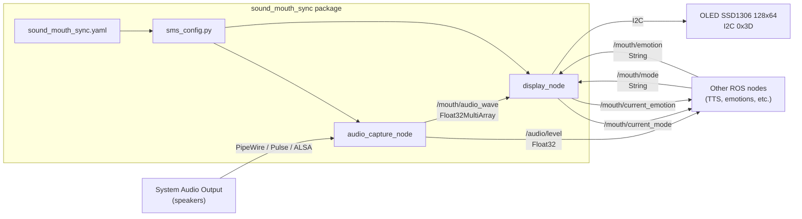
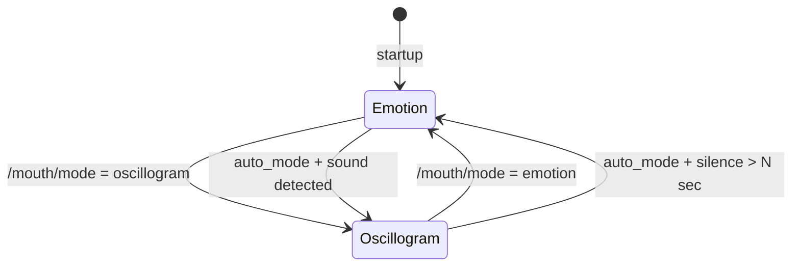
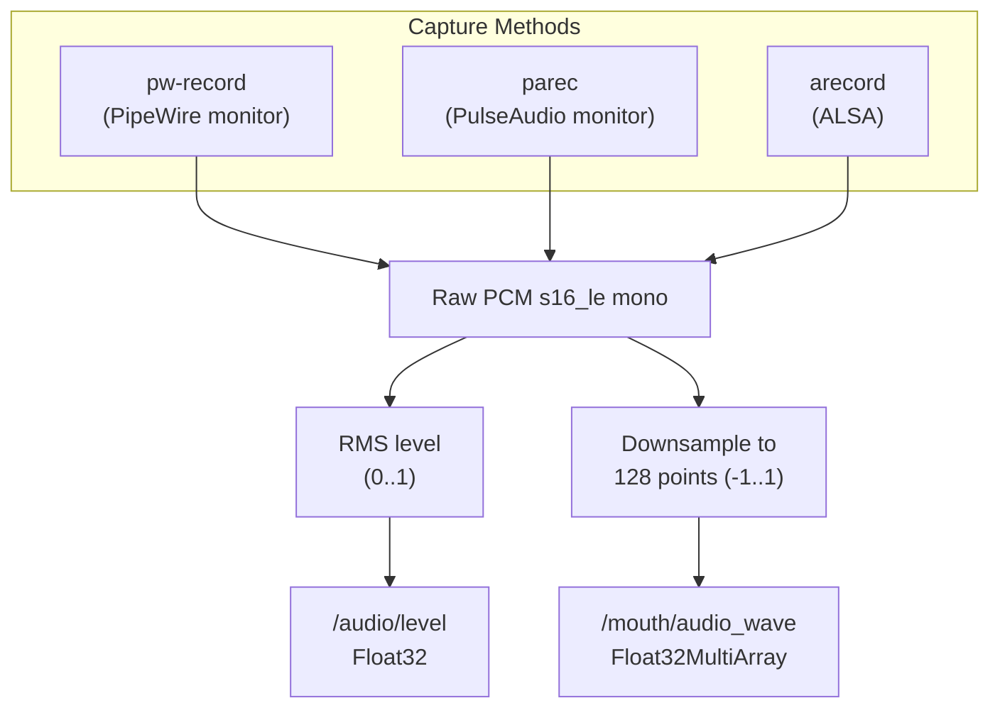
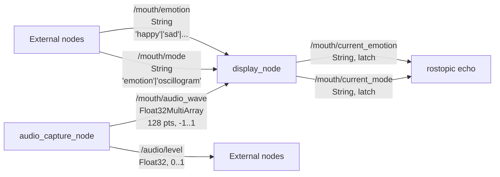

# sound_mouth_sync — Архитектура

## Общая схема

Пакет состоит из двух ROS-нод и конфигурационного модуля:



## Ноды

### 1. display_node (mouth_display_node)

**Файл:** `scripts/display_node.py`

Управляет OLED-дисплеем. Работает в одном из двух режимов:



**Режим emotion:**
- Рисует встроенную эмоцию (Pillow / ImageDraw)
- Или загружает пользовательский PNG из `resources/emotions/`
- Обновляется по сообщению в `/mouth/emotion`

**Режим oscillogram:**
- Принимает 128 значений (-1..1) из `/mouth/audio_wave`
- Рисует линию осциллограммы на дисплее
- При тишине (RMS < 0.02) — горизонтальная прямая

**Авто-режим (auto_mode):**
- При обнаружении звука (RMS >= 0.02) — переключение в oscillogram
- После `silence_return_sec` секунд тишины — возврат к emotion

### 2. audio_capture_node (mouth_audio_capture_node)

**Файл:** `scripts/audio_capture_node.py`

Захватывает ВСЕ звуки системы (не конкретный файл).



**Приоритет источников:**
1. `pipewire_monitor` — pw-record, захват с вывода на динамики (по умолчанию)
2. `pulse_monitor` — parec, fallback при недоступности PipeWire
3. `alsa` — arecord, захват с микрофона

**Автоматический fallback:** при ошибках PipeWire (Broken pipe) автоматически переключается на PulseAudio monitor.

### 3. sms_config.py

**Файл:** `scripts/sms_config.py`

Модуль конфигурации. Читает `config/sound_mouth_sync.yaml` (загруженный в rosparam через launch) и предоставляет API:

- `get_hardware_settings()` — I2C адрес, порт, размер дисплея
- `get_emotions_config()` — список эмоций, эмоция по умолчанию
- `get_display_settings()` — auto_mode, silence_return_sec
- `get_audio_capture_config()` — source, rate, chunk_size

## Топики



## Файловая структура

```
sound_mouth_sync/
├── package.xml                    # ROS package manifest
├── CMakeLists.txt                 # Build configuration
├── config/
│   └── sound_mouth_sync.yaml      # All parameters
├── launch/
│   └── sound_mouth_sync.launch    # Launches both nodes
├── scripts/
│   ├── display_node.py            # Node 1: OLED display
│   ├── audio_capture_node.py      # Node 2: audio capture
│   └── sms_config.py              # Config module
├── resources/
│   └── emotions/                  # Custom emotion PNGs (128x64, 1-bit)
├── doc/
│   ├── ARCHITECTURE.md            # This file
│   └── AI_CONTEXT.md              # Context for AI developers
└── README.md                      # User-facing documentation
```

## Интеграция с системой

Пакет запускается из `ainex_bringup/launch/bringup.launch`:

```xml
<include file="$(find sound_mouth_sync)/launch/sound_mouth_sync.launch">
    <arg name="default_emotion" value="neutral"/>
</include>
```

Другие пакеты (TTS, навигация, телеоперация) могут:
- Устанавливать эмоцию: `rostopic pub /mouth/emotion std_msgs/String "data: 'happy'"`
- Переключать режим: `rostopic pub /mouth/mode std_msgs/String "data: 'emotion'"`
- Слушать уровень звука: `rostopic echo /audio/level`
