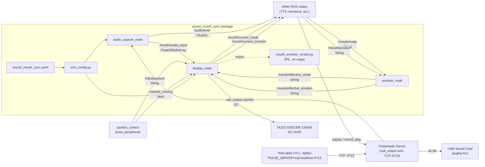
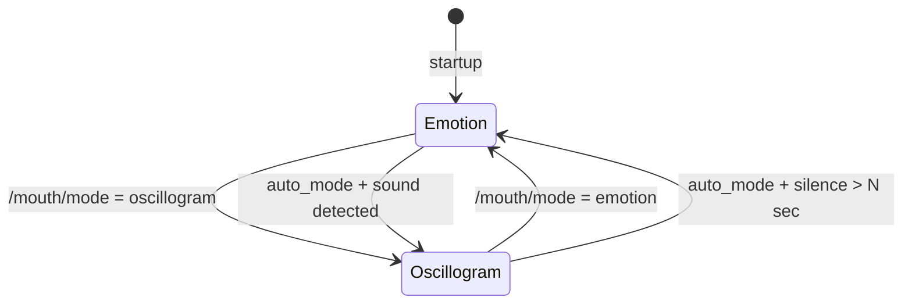
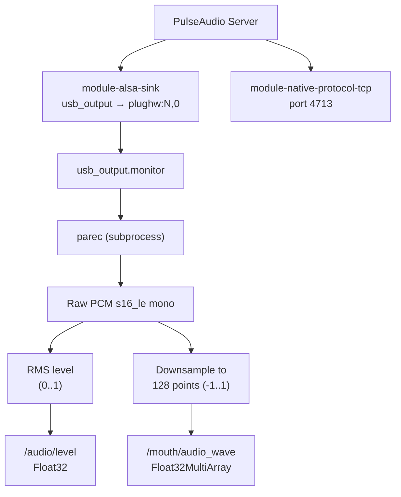
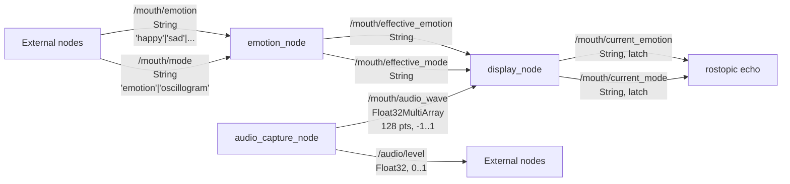

# sound_mouth_sync — Архитектура

## Общая схема

Пакет состоит из трёх ROS-нод, конфигурационного модуля и **библиотеки пиксельного рендера эмоций** (`mouth_emotion_render.py` — не нода, без rospy).



## Ноды

### 0. emotion_node (mouth_emotion_node)

**Файл:** `scripts/emotion_node.py`

Тонкий слой хранения пользовательских команд эмоций/режима:

- Подписывается на внешние API-топики:
  - `/mouth/mode`
  - `/mouth/emotion`
- Публикует latched-топики для рендера:
  - `/mouth/effective_mode`
  - `/mouth/effective_emotion`

Это позволяет держать внешние команды совместимыми и вынести хранение текущей эмоции/режима из `display_node`.

**Пиксели на экране не рисует** — только топики. Вся отрисовка рта приходит из `display_node`, который для кадров эмоций вызывает модуль ниже.

### Модуль `mouth_emotion_render.py` (рендер эмоций, не ROS-нода)

**Файл:** `scripts/mouth_emotion_render.py`  
**Назначение:** собрать 1-битный кадр PIL под SSD1306 128×64 для режима *emotion* (idle, падение, кастомные PNG, встроенные дуги/линии). Устанавливается рядом с нодами (`CMakeLists.txt` → `install(FILES ...)`).

| Что внутри | Роль |
|------------|------|
| `VALID_EMOTIONS`, `FALL_POSTURES` | Справочники имён эмоций и постур падения (дублируют контракт с `display_node` при нормализации). |
| `load_custom_emotion_image`, `load_idle_faces` | Загрузка из `resources/emotions/` (png/bmp/gif) и из `resources/idle_faces/` (мультикадровые GIF или папки PNG с длительностями). |
| `draw_emotion` | Векторные «рожицы» по имени (happy, sad, angry, sleepy как статичная сигарета и т.д.). |
| `draw_emotion_angry_fall` | Отдельный кадр для падения: зубы + царапины, если нет `angry.png`. |
| `draw_sleepy_animated`, `sleepy_anim_reset` | Анимация «сигарета + дым» (частицы), состояние в словаре `sleepy_state`. |
| `draw_builtin_idle_cat`, `draw_builtin_idle_yawn_zzz` | Встроенные idle-анимации, если `idle_faces/` пуст. |
| `cat_animation_bitmap` / `sleep_animation_bitmap` | Покадровая смена из предзагруженных битмапов `cat_frame0/1`, `sleep_frame1…3` (как раньше из `resources/emotions/`). |
| `idle_face_pick_random`, `idle_face_get_frame`, `builtin_idle_get_frame` | Выбор и проигрывание случайной idle-анимации из папки или тройки cigarette/cat/yawn. |
| `compose_emotion_frame` | **Единая точка композиции:** приоритет PNG → cat/sleep битмапы → падение → оверлей idle-sleep из YAML/pool → обычная эмоция. Сюда из `display_node` передаются кэш картинок, флаги `robot_fallen`, `idle_sleep_active`, словари состояния анимаций. |

**Чего здесь нет:** ROS, I2C, осциллограмма (`display_node` рисует волну сам), логика таймеров «когда переключить режим» — всё это остаётся в `display_node`.

**Кто импортирует:** только `display_node`. `emotion_node` модуль не трогает.

### 1. display_node (mouth_display_node)

**Файл:** `scripts/display_node.py`

Управляет OLED-дисплеем и импортирует `mouth_emotion_render` для всех кадров режима *emotion*; осциллограмма рисуется **только** в этом файле (`_draw_oscillogram_waveform`). Поддерживает параметр `rotate` (0/1/2/3) для физически перевёрнутого монтажа (по умолчанию `rotate=2` — дисплей перевёрнут на 180°). Работает в одном из двух режимов:



**Режим emotion:**
- Кадр собирается через `mouth_emotion_render.compose_emotion_frame` (встроенные дуги, кастомные PNG из `resources/emotions/`, idle из `resources/idle_faces/`, анимации cat/sleep/sleepy)
- Обновляется по `/mouth/effective_emotion` и внутренним таймерам (idle-sleep, анимации)

**Режим oscillogram:**
- Принимает 128 значений (-1..1) из `/mouth/audio_wave`
- Рисует линию осциллограммы на дисплее
- При тишине (RMS < 0.02) — горизонтальная прямая

**Авто-режим (auto_mode):**
- При обнаружении звука (RMS >= 0.02) — переключение в oscillogram
- После `silence_return_sec` секунд тишины — возврат к emotion

**Приоритет эмоций (поверх пользовательской):**
1. Падение — топик `/robot/posture` ∈ `{fall_forward, fall_backward, fall_left, fall_right}`: на экране `fall_emotion` (по умолчанию `angry`), осциллограмма отключена до `stand`. Для `angry` без `resources/emotions/angry.*` — векторная отрисовка (зубы, царапина). Источник: `joystick_control` в пакете `ainex_peripherals` (детектор по IMU).
2. Обычная работа — эмоция с `/mouth/emotion` и осциллограмма по звуку.
3. Долгое бездействие — параметр `idle_sleep_sec` (по умолчанию 60 с): нет слышимого звука, нет ходьбы (`/robot/is_moving`), режим эмоций → показ `idle_sleep_emotion` (по умолчанию `sleepy`). Для `sleepy` без `sleepy.*` в `resources/emotions/` — анимация «сигарета + дым». См. `idle_require_movement_signal` в конфиге.

### 2. audio_capture_node (mouth_audio_capture_node)

**Файл:** `scripts/audio_capture_node.py`

Захватывает ВСЕ звуки системы (не конкретный файл). Является единственным «владельцем» аудио — запускает PulseAudio-сервер.



**При запуске:**
1. Запуск нативного PulseAudio (`pulseaudio --start --exit-idle-time=-1`)
2. Автоопределение USB-звуковой карты через `/proc/asound/cards`
3. Загрузка `module-alsa-sink` → создание `usb_output` sink
4. Установка `usb_output` как default sink
5. Загрузка `module-native-protocol-tcp` (порт 4713, auth-anonymous) для доступа с хоста
6. Запуск `parec -d usb_output.monitor` для захвата

**TCP-доступ для хоста:** приложения на Raspberry Pi могут воспроизводить звук через `PULSE_SERVER=tcp:127.0.0.1:4713`. Этот звук проходит через `usb_output` → USB-карту → динамик, и одновременно захватывается через `.monitor` для осциллограммы.

Предупреждает после 200 тихих чанков подряд.

### 4. Утилиты

**`scripts/usb_audio_reset.sh`** — сброс USB-звуковой карты через sysfs после перезагрузки.

**`scripts/audio_diag.sh`** — диагностика аудио: ALSA-устройства, PulseAudio статус, проверка сокетов, тест захвата.

**`scripts/setup_host_audio.sh`** — настройка хоста (Raspberry Pi) для маршрутизации звука в Docker PulseAudio (устанавливает `PULSE_SERVER=tcp:127.0.0.1:4713`).

### 3. sms_config.py

**Файл:** `scripts/sms_config.py`

Модуль конфигурации. Читает `config/sound_mouth_sync.yaml` (загруженный в rosparam через launch) и предоставляет API:

- `get_hardware_settings()` — I2C адрес, порт, размер дисплея
- `get_emotions_config()` — список эмоций, эмоция по умолчанию
- `get_display_settings()` — auto_mode, silence_return_sec
- `get_audio_capture_config()` — source, rate, chunk_size

## Топики



## Файловая структура

```
sound_mouth_sync/
├── package.xml                    # ROS package manifest
├── CMakeLists.txt                 # Build configuration
├── ROADMAP.md                     # Future plans
├── config/
│   └── sound_mouth_sync.yaml      # All parameters (incl. rotate, device auto-detect)
├── launch/
│   └── sound_mouth_sync.launch    # Launches nodes (display, audio, emotion)
├── scripts/
│   ├── emotion_node.py             # Node 0: effective mode/emotion topics
│   ├── display_node.py            # Node 1: OLED (emotion via mouth_emotion_render + oscillogram)
│   ├── audio_capture_node.py      # Node 2: audio capture (PulseAudio, USB auto-detect)
│   ├── mouth_emotion_render.py   # PIL 1-bit emotion frames (imported by display_node, not a node)
│   ├── mouth_audio_gates.py       # Waveform / level thresholds (display + tests)
│   ├── sms_config.py              # Config module
│   ├── usb_audio_reset.sh         # USB audio device reset after reboot
│   ├── audio_diag.sh              # Audio diagnostics script
│   └── setup_host_audio.sh        # Host → Docker audio redirect setup
├── resources/
│   ├── emotions/                  # Custom emotion PNGs (128x64, 1-bit)
│   └── README_EMOTIONS.md         # Guide for custom emotions
├── doc/
│   ├── ARCHITECTURE.md            # This file
│   ├── AI_CONTEXT.md              # Context for AI developers
│   └── AUDIO_PLAYBACK.md          # Developer guide: sound playback + oscillogram
└── README.md                      # User-facing documentation
```

## Интеграция с системой

Пакет запускается из `ainex_bringup/launch/bringup.launch`:

```xml
<include file="$(find sound_mouth_sync)/launch/sound_mouth_sync.launch">
    <arg name="default_emotion" value="neutral"/>
</include>
```

Другие пакеты (TTS, навигация, телеоперация) могут:
- Устанавливать эмоцию: `rostopic pub /mouth/emotion std_msgs/String "data: 'happy'"`
- Переключать режим: `rostopic pub /mouth/mode std_msgs/String "data: 'emotion'"`
- Слушать уровень звука: `rostopic echo /audio/level`
- Воспроизводить звук через PulseAudio (внутри Docker — автоматически, с хоста — через `PULSE_SERVER=tcp:127.0.0.1:4713`)

Подробное руководство по воспроизведению звука: [AUDIO_PLAYBACK.md](AUDIO_PLAYBACK.md)

Состояние тела для рта: узел `joystick_control` (`ainex_peripherals`) публикует с защёлкой `/robot/posture` и `/robot/is_moving` — см. `control/joystick_controller.py`.

## Два дисплея: разделение ответственности

```
I2C bus 1
├── 0x3C  ← ainex_bringup/oled_display.py   (системный статус: SSID, IP, CPU, BAT)
└── 0x3D  ← sound_mouth_sync/display_node.py (рот: эмоции через mouth_emotion_render + осциллограмма в display_node)
```

Адрес **0x3D** на модуле рта задаётся **железом**: на платах SSD1306 часто выведена зона **IIC ADDRESS SELECT** — два варианта пайки **SMD-резистора** (перемычки). На шёлке печатной платы могут быть подписи **0x78** и **0x7A**: это **8-битные** обозначения (как в некоторых даташитах, с учётом бита R/W). Соответствие **7-bit** адресу на шине: **0x78 → 0x3C**, **0x7A → 0x3D**. По умолчанию у модуля часто стоит позиция **0x78 (0x3C)** — для **рта** резистор переносят на **0x7A**, чтобы на `i2cdetect` появилась отдельная строка **3d**. В `config/sound_mouth_sync.yaml` → `hardware.i2c_address` и `oled_i2c_address` в launch должны **совпадать** с выбранной позицией (для рта — **0x3D**). Иллюстрация: `doc/images/oled_i2c_address_select_example.png`. Как внести это в Visio: [VISIO_SCHEME_OLED_JUMPER.md](VISIO_SCHEME_OLED_JUMPER.md).

Два независимых изображения на одной шине **невозможны**, если оба чипа слушают один адрес.

`oled_display.py` пишет только на **0x3C**; `display_node.py` — на адрес из конфига (**0x3D**). Опционально: env **`AINEX_STATS_PAUSE_ON_3C_UNLESS_3D`** — не обновлять статус на 0x3C, пока на шине не виден рот на **0x3D** (подробности в [SECOND_DISPLAY_ARCHITECTURE.md](SECOND_DISPLAY_ARCHITECTURE.md), §8.6). Параметры **`mouth_display_redraw_after_sec`** / **`reassert_effective_topics_after_sec`** в YAML (`display`) — мягкая подстраховка после старта.

Симптом «на рту как на 0x3C» **может снова проявиться**, если вернётся дублирующий адрес **0x3C** на двух модулях или пропадёт **0x3D**; только обновление документации/ПО **не** даёт гарантии «никогда больше» без проверки железа. Долгое выключение питания само по себе не является объяснением — см. §8 в [SECOND_DISPLAY_ARCHITECTURE.md](SECOND_DISPLAY_ARCHITECTURE.md).

При проблемах — «Troubleshooting» в [AI_CONTEXT.md](AI_CONTEXT.md#troubleshooting-два-oled-дисплея), [README.md](../README.md), [SECOND_DISPLAY_ARCHITECTURE.md](SECOND_DISPLAY_ARCHITECTURE.md) §8–8.7.

### Симптом «вчера всё ОК, после ночи / холодного включения на «рту» SSID/IP (как на 0x3C)»

**Что наблюдали:** вечером осциллограмма и эмоции на модуле рта работали, статистика не дублировалась; на следующий день после включения на физическом экране рта снова видна системная строка (SSID, IP, CPU…), хотя она должна быть **только** на дисплее **0x3C**.

**Почему это не «ПО перепутало 3C и 3D после простоя».** Код `ainex_bringup`/`oled_display.py` отправляет статистику **строго на I2C 0x3C** и не имеет легального режима писать то же содержимое на **0x3D**. Если картинка «как с системного экрана» видна на втором физическом модуле, значит этот модуль **принимает те же кадры, что и системный**, то есть на шине **оба SSD1306 настроены на один адрес (часто оба 0x3C)**, либо модуль рта **не отвечает на 0x3D**, а вы видите только трафик на **0x3C**. Длительное выключение питания **само по себе** не меняет бит прошивки «адрес»; совпадение со временем обычно связано с **контактом, питанием, холодным стартом** (модуль рта позже выходит на шину или временно «теряется»). Команда `/mouth/mode` = oscillogram **не отменяет** дублирование адреса и не отключает `oled_display`.

**Что сделать (порядок):**

1. `sudo i2cdetect -y 1` — норма для двух модулей: **и `3c`, и `3d`**. Только `3c` при дубле на «рту» → проверить **перемычку ADDR на плате рта = 0x3D** (даташит модуля), кабель, питание.
2. Лог `mouth_display_node`: после `init_pose` нода **опрашивает шину** до появления **0x3D** (параметр `hardware.mouth_oled_startup_delay_sec` — **максимум** секунд ожидания; раньше дисплей открывался после слепой паузы **до** standup). При таймауте и при **есть 0x3C, нет 0x3D** в лог пишется **DIAGNOSTIC** с подсказкой про дубль адреса.
3. Если рот на холодном старте поднимается медленно — увеличьте `mouth_oled_startup_delay_sec` в `config/sound_mouth_sync.yaml` (например **12–15** с). Нужен пакет **`i2c-tools`** (`i2cdetect`) для опроса.
4. Подстраховки без замены железа (не отменяют пункт 1): [SECOND_DISPLAY_ARCHITECTURE.md §8.6](SECOND_DISPLAY_ARCHITECTURE.md#86-программные-меры-не-заменяют-разный-i2c-адрес).

Подробная разборка механизма: [SECOND_DISPLAY_ARCHITECTURE.md §8](SECOND_DISPLAY_ARCHITECTURE.md#8-два-физических-oled-типичные-сбои-ssidip-на-рту-пропадание-0x3d), §8.7.

### Порядок запуска (bringup.launch)

1. `base.launch` — `ainex_controller` поднимает робота, устанавливает `init_pose/init_finish=True`
2. `sound_mouth_sync.launch` — `display_node` и `audio_capture_node` ждут `init_finish` до `wait_standup_timeout_sec` (30 с), затем стартуют с `proceed_without_standup=true`
3. `oled_display.py` запускается как отдельный systemd-сервис (или фоновый процесс в Docker)

### Частая ошибка: ноды висят, дисплей пустой

Если `ainex_controller` не установил `init_pose/init_finish=True`, ноды `sound_mouth_sync` будут ждать. Решение — задать таймаут:

```bash
roslaunch sound_mouth_sync sound_mouth_sync.launch wait_standup_timeout_sec:=30 proceed_without_standup:=true
```

Или для отладки без робота:

```bash
rosparam set /init_pose/init_finish true
```
