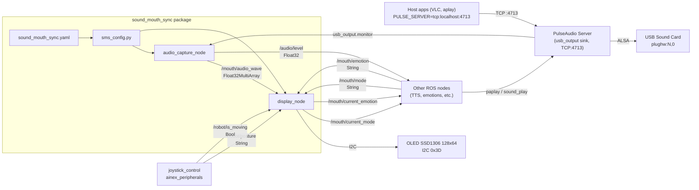
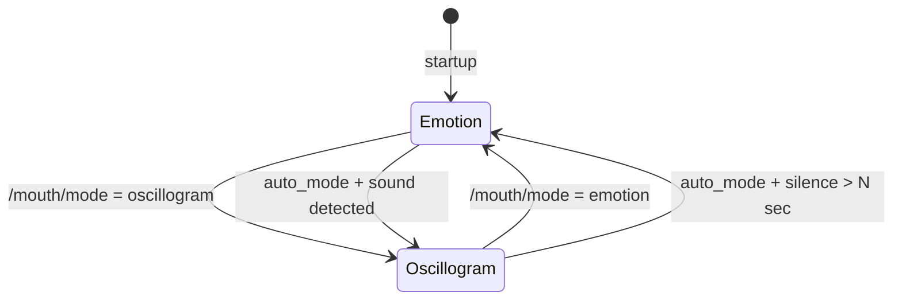
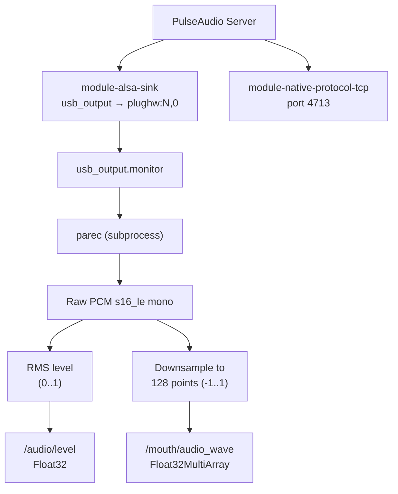
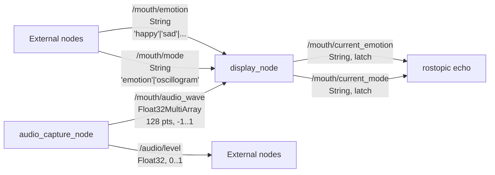

# sound_mouth_sync — Архитектура

## Общая схема

Пакет состоит из двух ROS-нод и конфигурационного модуля:



## Ноды

### 1. display_node (mouth_display_node)

**Файл:** `scripts/display_node.py`

Управляет OLED-дисплеем. Поддерживает параметр `rotate` (0/1/2/3) для физически перевёрнутого монтажа (по умолчанию `rotate=2` — дисплей перевёрнут на 180°). Работает в одном из двух режимов:



**Режим emotion:**
- Рисует встроенную эмоцию (Pillow / ImageDraw)
- Или загружает пользовательский PNG из `resources/emotions/`
- Обновляется по сообщению в `/mouth/emotion`

**Режим oscillogram:**
- Принимает 128 значений (-1..1) из `/mouth/audio_wave`
- Рисует линию осциллограммы на дисплее
- При тишине (RMS < 0.02) — горизонтальная прямая

**Авто-режим (auto_mode):**
- При обнаружении звука (RMS >= 0.02) — переключение в oscillogram
- После `silence_return_sec` секунд тишины — возврат к emotion

**Приоритет эмоций (поверх пользовательской):**
1. Падение — топик `/robot/posture` ∈ `{fall_forward, fall_backward, fall_left, fall_right}`: на экране `fall_emotion` (по умолчанию `angry`), осциллограмма отключена до `stand`. Для `angry` без `resources/emotions/angry.*` — векторная отрисовка (зубы, царапина). Источник: `joystick_control` в пакете `ainex_peripherals` (детектор по IMU).
2. Обычная работа — эмоция с `/mouth/emotion` и осциллограмма по звуку.
3. Долгое бездействие — параметр `idle_sleep_sec` (по умолчанию 60 с): нет слышимого звука, нет ходьбы (`/robot/is_moving`), режим эмоций → показ `idle_sleep_emotion` (по умолчанию `sleepy`). Для `sleepy` без `sleepy.*` в `resources/emotions/` — анимация «дыхание + Zzz». См. `idle_require_movement_signal` в конфиге.

### 2. audio_capture_node (mouth_audio_capture_node)

**Файл:** `scripts/audio_capture_node.py`

Захватывает ВСЕ звуки системы (не конкретный файл). Является единственным «владельцем» аудио — запускает PulseAudio-сервер.



**При запуске:**
1. Запуск нативного PulseAudio (`pulseaudio --start --exit-idle-time=-1`)
2. Автоопределение USB-звуковой карты через `/proc/asound/cards`
3. Загрузка `module-alsa-sink` → создание `usb_output` sink
4. Установка `usb_output` как default sink
5. Загрузка `module-native-protocol-tcp` (порт 4713, auth-anonymous) для доступа с хоста
6. Запуск `parec -d usb_output.monitor` для захвата

**TCP-доступ для хоста:** приложения на Raspberry Pi могут воспроизводить звук через `PULSE_SERVER=tcp:127.0.0.1:4713`. Этот звук проходит через `usb_output` → USB-карту → динамик, и одновременно захватывается через `.monitor` для осциллограммы.

Предупреждает после 200 тихих чанков подряд.

### 4. Утилиты

**`scripts/usb_audio_reset.sh`** — сброс USB-звуковой карты через sysfs после перезагрузки.

**`scripts/audio_diag.sh`** — диагностика аудио: ALSA-устройства, PulseAudio статус, проверка сокетов, тест захвата.

**`scripts/setup_host_audio.sh`** — настройка хоста (Raspberry Pi) для маршрутизации звука в Docker PulseAudio (устанавливает `PULSE_SERVER=tcp:127.0.0.1:4713`).

### 3. sms_config.py

**Файл:** `scripts/sms_config.py`

Модуль конфигурации. Читает `config/sound_mouth_sync.yaml` (загруженный в rosparam через launch) и предоставляет API:

- `get_hardware_settings()` — I2C адрес, порт, размер дисплея
- `get_emotions_config()` — список эмоций, эмоция по умолчанию
- `get_display_settings()` — auto_mode, silence_return_sec
- `get_audio_capture_config()` — source, rate, chunk_size

## Топики



## Файловая структура

```
sound_mouth_sync/
├── package.xml                    # ROS package manifest
├── CMakeLists.txt                 # Build configuration
├── ROADMAP.md                     # Future plans
├── config/
│   └── sound_mouth_sync.yaml      # All parameters (incl. rotate, device auto-detect)
├── launch/
│   └── sound_mouth_sync.launch    # Launches both nodes
├── scripts/
│   ├── display_node.py            # Node 1: OLED display (rotate support)
│   ├── audio_capture_node.py      # Node 2: audio capture (PulseAudio, USB auto-detect)
│   ├── sms_config.py              # Config module
│   ├── usb_audio_reset.sh         # USB audio device reset after reboot
│   ├── audio_diag.sh              # Audio diagnostics script
│   └── setup_host_audio.sh        # Host → Docker audio redirect setup
├── resources/
│   ├── emotions/                  # Custom emotion PNGs (128x64, 1-bit)
│   └── README_EMOTIONS.md         # Guide for custom emotions
├── doc/
│   ├── ARCHITECTURE.md            # This file
│   ├── AI_CONTEXT.md              # Context for AI developers
│   └── AUDIO_PLAYBACK.md          # Developer guide: sound playback + oscillogram
└── README.md                      # User-facing documentation
```

## Интеграция с системой

Пакет запускается из `ainex_bringup/launch/bringup.launch`:

```xml
<include file="$(find sound_mouth_sync)/launch/sound_mouth_sync.launch">
    <arg name="default_emotion" value="neutral"/>
</include>
```

Другие пакеты (TTS, навигация, телеоперация) могут:
- Устанавливать эмоцию: `rostopic pub /mouth/emotion std_msgs/String "data: 'happy'"`
- Переключать режим: `rostopic pub /mouth/mode std_msgs/String "data: 'emotion'"`
- Слушать уровень звука: `rostopic echo /audio/level`
- Воспроизводить звук через PulseAudio (внутри Docker — автоматически, с хоста — через `PULSE_SERVER=tcp:127.0.0.1:4713`)

Подробное руководство по воспроизведению звука: [AUDIO_PLAYBACK.md](AUDIO_PLAYBACK.md)

Состояние тела для рта: узел `joystick_control` (`ainex_peripherals`) публикует с защёлкой `/robot/posture` и `/robot/is_moving` — см. `control/joystick_controller.py`.
