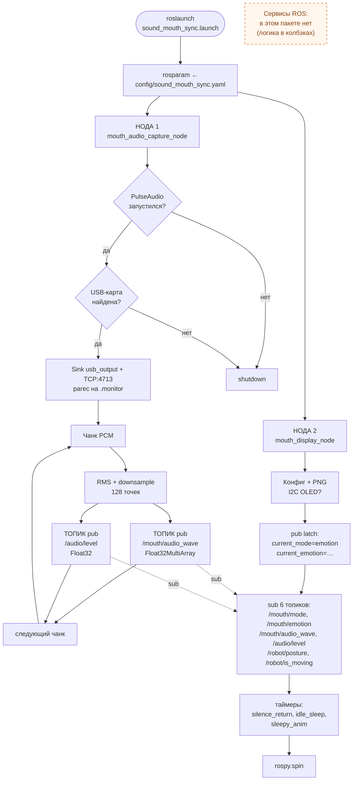
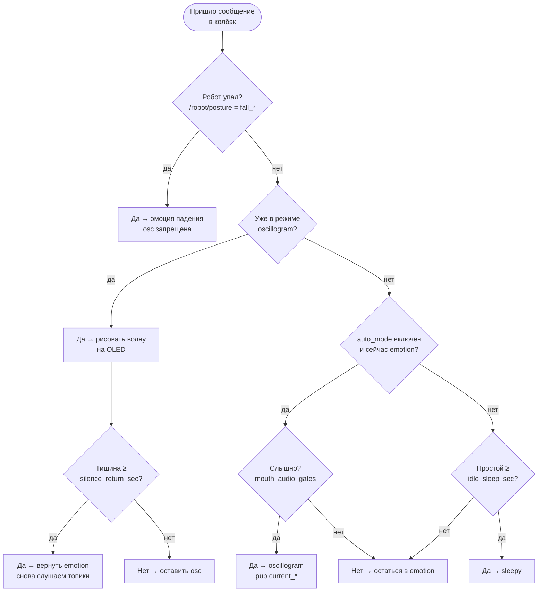
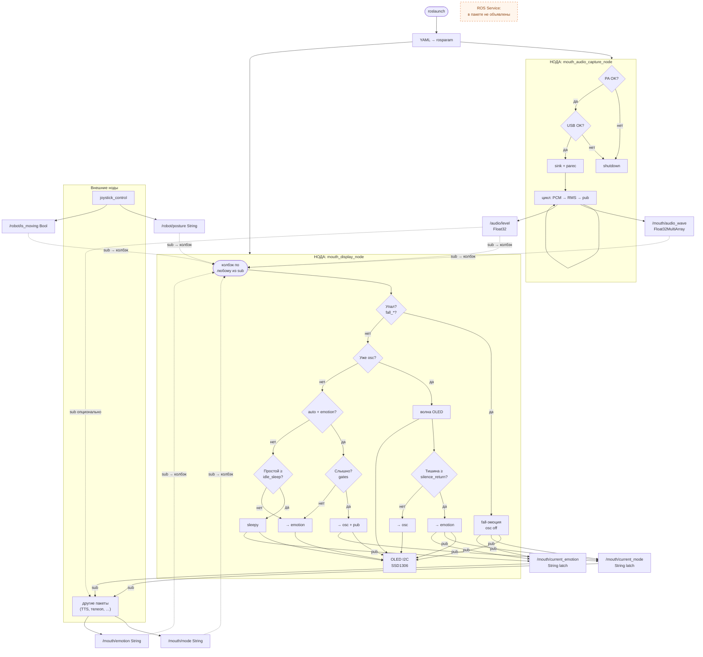

# Архитектура ROS-пакета `sound_mouth_sync`

Пакет управляет **вторым дисплеем** робота Ainex (OLED SSD1306 128x64, I2C, область рта).

---

## 1. Поэтапный запуск (что происходит по шагам)

Команда:

```bash
roslaunch sound_mouth_sync sound_mouth_sync.launch
```

### Этап 0 — roslaunch загружает конфиг

```
roslaunch
  │
  ├─ rosparam load config/sound_mouth_sync.yaml   ← параметры в Parameter Server
  │
  ├─ Запускает НОДУ 1: mouth_display_node
  └─ Запускает НОДУ 2: mouth_audio_capture_node
```

Обе ноды стартуют **параллельно** (roslaunch не гарантирует порядок). Но `display_node` готов сразу (рисует эмоцию), а `audio_capture` тратит 5-10 секунд на PulseAudio. Порядок не важен — они связаны только через **топики**.

### Этап 1 — `mouth_audio_capture_node` поднимает звук

```
mouth_audio_capture_node запустилась
  │
  ├─ 1.1  Запуск PulseAudio (pulseaudio --start)
  ├─ 1.2  Поиск USB-звуковой карты (/proc/asound/cards)
  │       Нет карты? → rospy.signal_shutdown(), нода умирает
  ├─ 1.3  Создание PA sink "usb_output" (module-alsa-sink)
  ├─ 1.4  Включение TCP:4713 (module-native-protocol-tcp)
  ├─ 1.5  Запись /etc/pulse/client.conf
  ├─ 1.6  Создание Publisher:
  │         /mouth/audio_wave  (Float32MultiArray)
  │         /audio/level       (Float32)
  ├─ 1.7  Запуск потока capture_loop:
  │         parec -d usb_output.monitor → PCM → downsample → publish
  └─ 1.8  rospy.spin() — ожидание shutdown
```

### Этап 2 — `mouth_display_node` готовит дисплей

```
mouth_display_node запустилась
  │
  ├─ 2.1  Чтение конфига (sms_config → YAML + rosparam)
  ├─ 2.2  Загрузка кастомных PNG из resources/emotions/
  ├─ 2.3  Инициализация OLED по I2C (luma.oled ssd1306)
  │       I2C недоступен? → продолжает без экрана (logwarn)
  ├─ 2.4  Создание Publisher:
  │         /mouth/current_mode    (String, latch)
  │         /mouth/current_emotion (String, latch)
  ├─ 2.5  Публикация начального состояния:
  │         current_mode = "emotion"
  │         current_emotion = "neutral" (или default_emotion)
  ├─ 2.6  Отрисовка начальной эмоции на OLED
  ├─ 2.7  Создание Subscriber (6 штук):
  │         /mouth/mode          ← внешняя команда
  │         /mouth/emotion       ← внешняя команда
  │         /mouth/audio_wave    ← от audio_capture
  │         /audio/level         ← от audio_capture
  │         /robot/posture       ← от joystick_control
  │         /robot/is_moving     ← от joystick_control
  ├─ 2.8  Запуск таймеров:
  │         auto_return_tick  (0.3 с) — возврат из osc в emotion при тишине
  │         on_idle_tick      (0.5 с) — проверка простоя → sleepy
  │         sleepy_anim_tick  (0.12 с) — анимация «курит» для sleepy
  └─ 2.9  rospy.spin()
```

### Этап 3 — рабочий цикл (обе ноды работают)

```
audio_capture (каждый чанк ~21 мс при 48000/1024):
  PCM → RMS + downsample → publish /mouth/audio_wave + /audio/level
       │                          │
       ▼                          ▼
display_node (колбэки):
  on_audio_wave() → слышно? → да → переключить на oscillogram, рисовать волну
                            → нет → ничего (таймер вернёт в emotion через 3 с)
  on_audio_level() → подстраховка для тихих файлов
  on_mode()        → ручное переключение emotion/oscillogram
  on_emotion()     → сменить эмоцию
  on_posture()     → падение? → принудительно emotion + fall_emotion
  on_moving()      → сбросить таймер простоя
  idle_tick()      → 120 с без активности? → sleepy
```

### Этап 4 — завершение (rosnode kill / Ctrl+C)

```
rospy.on_shutdown:
  display_node → рисует "neutral" на OLED → выход
  audio_capture → terminate parec → выход
```

---

## 2. Ноды

| # | ROS-имя | Скрипт | Что делает |
|---|---------|--------|------------|
| 1 | `mouth_display_node` | `display_node.py` | Рисует на OLED: эмоции или осциллограмму. Решает, что показать (приоритеты: падение > ручной режим > авто > простой). Публикует фактическое состояние. |
| 2 | `mouth_audio_capture_node` | `audio_capture_node.py` | Поднимает PulseAudio, захватывает весь системный звук через `parec`, публикует волну и уровень. |
| — | *(внешняя)* `joystick_control` | пакет `ainex_peripherals` | Публикует `/robot/posture` и `/robot/is_moving`. |
| — | *(внешние)* TTS, навигация и т.д. | другие пакеты | Публикуют `/mouth/mode` и `/mouth/emotion`. |

---

## 3. Топики

### 3.1 Публикация (Publisher)

| Топик | Тип | Откуда | Куда | Зачем |
|-------|-----|--------|------|-------|
| `/mouth/audio_wave` | `Float32MultiArray` | `audio_capture` | `display` | 128 точек волны для осциллограммы и определения «есть звук» |
| `/audio/level` | `Float32` | `audio_capture` | `display` + внешние | RMS 0..1, подстраховка для тихих файлов |
| `/mouth/current_mode` | `String` (latch) | `display` | внешние подписчики | Что сейчас на экране: `emotion` или `oscillogram` |
| `/mouth/current_emotion` | `String` (latch) | `display` | внешние подписчики | Какая эмоция реально нарисована |

### 3.2 Подписка (Subscriber)

| Топик | Тип | Откуда | Куда | Зачем |
|-------|-----|--------|------|-------|
| `/mouth/mode` | `String` | внешние ноды | `display` | Команда: `"emotion"` или `"oscillogram"` |
| `/mouth/emotion` | `String` | внешние ноды | `display` | Команда: имя эмоции (`happy`, `sad`, ...) |
| `/mouth/audio_wave` | `Float32MultiArray` | `audio_capture` | `display` | Данные волны |
| `/audio/level` | `Float32` | `audio_capture` | `display` | Доп. проверка уровня |
| `/robot/posture` | `String` | `joystick_control` | `display` | `stand` / `fall_*` — приоритет падения |
| `/robot/is_moving` | `Bool` | `joystick_control` | `display` | Ходьба сбрасывает таймер простоя |

---

## 4. Сервисы (Services)

### Факт: в пакете `sound_mouth_sync` сервисов **нет**

В коде нет ни одного `rospy.Service()` или `rospy.ServiceProxy()`. Все решения принимаются **внутри `display_node`** через колбэки топиков и таймеры.

### Где нужны сервисы по смыслу — «вопрос-ответ»

Ниже перечислены логические точки, которые **работают как вопрос-ответ** внутри кода и **могут быть вынесены в ROS Service**, если понадобится синхронный запрос от другой ноды:

| Логический «сервис» | Вопрос | Ответ | Где сейчас в коде | Возможный тип srv |
|---------------------|--------|-------|--------------------|-------------------|
| **Слышно ли звук?** | Дать 128 точек волны или RMS | `true` / `false` | `mouth_audio_gates.waveform_is_audible()` внутри `on_audio_wave()` | `std_srvs/SetBool` или свой `AudioGate.srv` |
| **Какой сейчас режим?** | (пустой запрос) | `"emotion"` или `"oscillogram"` | Читается из latched `/mouth/current_mode` | `std_srvs/Trigger` → message |
| **Какая эмоция на экране?** | (пустой запрос) | `"happy"`, `"sleepy"`, ... | Читается из latched `/mouth/current_emotion` | `std_srvs/Trigger` → message |
| **Робот упал?** | (пустой запрос) | `true` / `false` | `_robot_is_fallen()` в `display_node` | `std_srvs/Trigger` |
| **Установить эмоцию** | имя эмоции | `success` / `error` | Сейчас через топик `/mouth/emotion` | Свой `SetEmotion.srv` |
| **Переключить режим** | `"emotion"` или `"oscillogram"` | `success` | Сейчас через топик `/mouth/mode` | Свой `SetMode.srv` |

Сейчас все эти «вопросы» решаются **асинхронно** (топики + latch). Это нормально для данного пакета. Если вам нужен **синхронный** запрос-ответ (например, другая нода хочет **дождаться** результата), то можно добавить сервис.

---

## 5. Блок-схема архитектуры

Три уровня: **5.1** — ноды, важные топики, циклы запуска; **5.2** — логика `display_node` (ромбы = «вопрос-ответ» в коде); **5.3** — всё связано одной схемой. **ROS Service** в пакете не объявлены (§4); на рисунках это отдельная пометка, а не «лишняя нода».

### 5.1 Запуск, ноды, топики и циклы



### 5.2 Логика display_node (ветвления)



### 5.3 Одна схема: ноды → топики → логика → выход

Пунктир — **нет объявленных srv**; ромбы внутри `display_node` = вопрос-ответ в коде (§4).



### 5.4 SVG-файл

Файл **[`mouth_block_scheme_refined.svg`](mouth_block_scheme_refined.svg)** — отдельный чертёж в SVG (можно упростить вручную под презентацию).

---

## 6. Сводная таблица всех связей

| От | Связь | К | Тип | Направление |
|----|-------|---|-----|-------------|
| `audio_capture` | `/mouth/audio_wave` | `display` | Topic (pub→sub) | → |
| `audio_capture` | `/audio/level` | `display` + внешние | Topic (pub→sub) | → |
| внешние | `/mouth/mode` | `display` | Topic (pub→sub) | → |
| внешние | `/mouth/emotion` | `display` | Topic (pub→sub) | → |
| `joystick_control` | `/robot/posture` | `display` | Topic (pub→sub) | → |
| `joystick_control` | `/robot/is_moving` | `display` | Topic (pub→sub) | → |
| `display` | `/mouth/current_mode` | внешние | Topic (pub→sub, latch) | → |
| `display` | `/mouth/current_emotion` | внешние | Topic (pub→sub, latch) | → |
| `display` | I2C | OLED SSD1306 | Аппаратная шина | → |
| *(нет)* | *(нет)* | *(нет)* | Service | Не используется (см. §4) |

---

## 7. Связанные материалы

- [ARCHITECTURE.md](ARCHITECTURE.md) — PulseAudio, файловая структура.
- [README.md](../README.md) — запуск, параметры, примеры `rostopic`.
