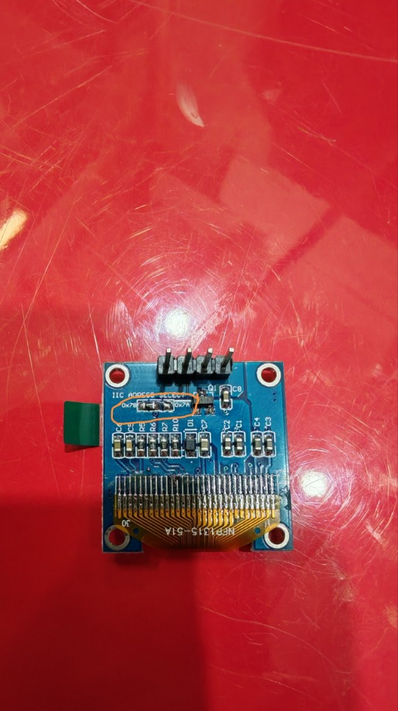

# Idle Faces — анимированные лица для режима сна

Эта папка содержит анимации, которые показываются на OLED-дисплее рта (**штатно I²C 7-bit 0x3D**)
когда робот находится в режиме `idle_sleep` (бездействие).

**Железо рта и idle-анимации.** Если картинки из этой папки «не видны», хотя топики настроены, чаще всего модуль рта отвечает не на **0x3D**, а на **0x3C** (заводская перемычка). На **обратной стороне платы дисплея** найдите область **IIC ADDRESS SELECT**: маленький **SMD-резистор** между площадками **0x78** и **0x7A** — это перемычка адреса (**0x78** → 7-bit **0x3C**, **0x7A** → **0x3D**). Для рта нужна позиция **0x7A**.

<p align="center">

</p>

*Рис. Плата модуля OLED (вид сзади): оранжевая отметка на фото подчёркивает зону перемычки IIC ADDRESS SELECT.*

Полный чеклист и контекст: [README.md](../../README.md) → раздел **«Два OLED»**.

## Как добавить новую анимацию

### Вариант 1: GIF-файл (рекомендуемый)

Положите файл `<name>.gif` в эту папку. Требования:
- Размер кадра: **128x64 пикселей**
- Цвет: **чёрно-белый** (1-bit). Цветные GIF будут автоматически конвертированы.
- Количество кадров: от 2 до 100.
- Скорость: задаётся в GIF (duration per frame). Если не задана — 120 мс на кадр (~8 FPS).

Пример: `sleepy_zzz.gif`, `winking.gif`, `yawning.gif`

### Вариант 2: Папка с PNG-кадрами

Создайте подпапку `<name>/` с пронумерованными PNG-файлами:
```
idle_faces/
  yawning/
    000.png
    001.png
    002.png
    ...
```

Требования к каждому PNG:
- Размер: **128x64 пикселей**
- Цвет: **чёрно-белый** (1-bit). Цветные PNG будут автоматически конвертированы.

Скорость анимации: 120 мс на кадр (~8 FPS). Можно изменить в YAML:
```yaml
sound_mouth_sync:
  display:
    idle_face_frame_ms: 120
```

## Поведение

- Когда робот входит в idle-sleep, **случайно** выбирается одна из анимаций.
- Анимация проигрывается циклически до пробуждения.
- Если папка пуста — показывается встроенная анимация «сигарета + дым».
- Пробуждение: звук, команда эмоции, движение робота.

## Инструменты для создания

- **GIMP**: File → Export As → GIF, отметить "As animation"
- **ImageMagick**: `convert -delay 12 -loop 0 frame_*.png animation.gif`
- **Python (Pillow)**:
  ```python
  from PIL import Image
  frames = [Image.open(f"frame_{i:03d}.png") for i in range(N)]
  frames[0].save("anim.gif", save_all=True, append_images=frames[1:],
                 duration=120, loop=0)
  ```
